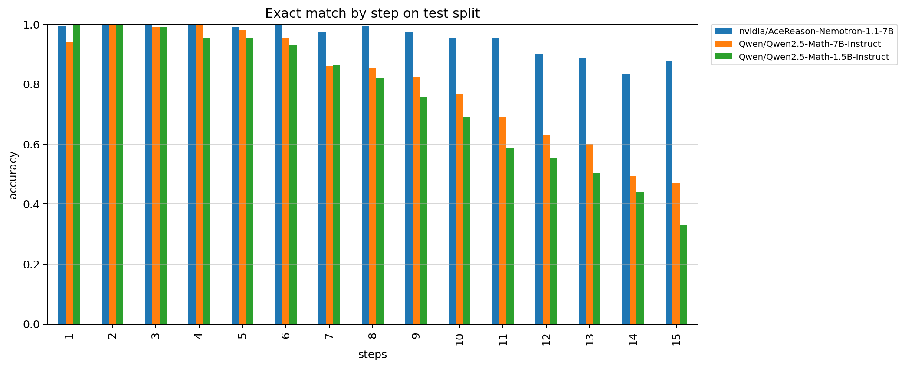
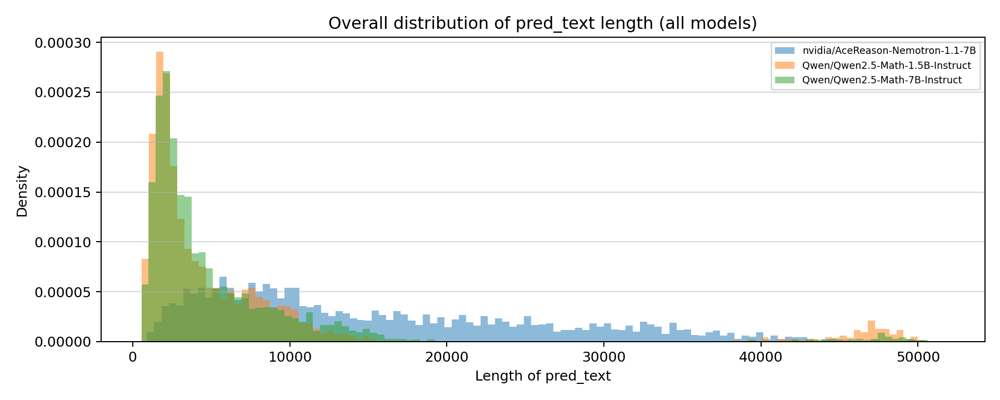
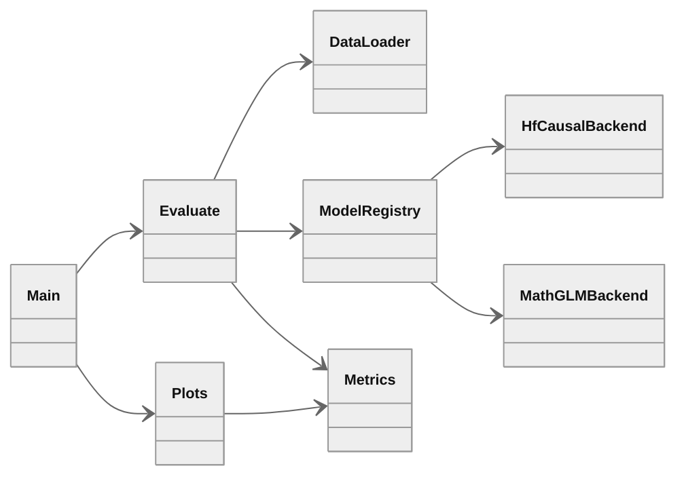

# calculator-benchmark

Evaluation pipeline for the [pymlex/calculator](https://huggingface.co/datasets/pymlex/calculator) arithmetic benchmark. Inference code and Colab workflow live in this repository. Per-model CSV files, metrics, and plots are stored under `results/`. The dataset card on Hugging Face is published from the same outputs via `scripts/sync_publish_hf.py`.

## Benchmark results

Dataset: [pymlex/calculator](https://huggingface.co/datasets/pymlex/calculator) test split, 3000 examples.

Models evaluated so far: `Qwen2.5-Math-1.5B`, `Qwen2.5-Math-7B`, `AceReason-Nemotron-1.1-7B`. `MathGLM-2B` is supported by the runner and will appear in the table after a successful Colab run.

Weighted score with step weights $s^2$, $s \in \{1,\ldots,15\}$:

$$
\mathrm{weighted\_score} = \frac{\sum_{s=1}^{15} (\mathrm{mean}(\mathrm{correct}_s) \cdot s^2)}{\sum_{s=1}^{15} s^2}

| model_id | overall_acc | weighted_score |
|---|---|---|
| nvidia/AceReason-Nemotron-1.1-7B | 0.955667 | 0.912847 |
| Qwen/Qwen2.5-Math-7B-Instruct | 0.803667 | 0.651044 |
| Qwen/Qwen2.5-Math-1.5B-Instruct | 0.758333 | 0.571052 |

Answer parsing order: `<answer>` tag, `\boxed{}`, last numeric token.

<p align="center">
  
</p>

<p align="center">
  
</p>

Raw per-model outputs: `results/run/*.csv`. Summary: `results/metrics.json`.

## Models

| Registry id | Backend |
|---|---|
| `Qwen/Qwen2.5-Math-1.5B-Instruct` | Transformers chat template, Qwen system prompt |
| `Qwen/Qwen2.5-Math-7B-Instruct` | Transformers chat template, Qwen system prompt |
| `nvidia/AceReason-Nemotron-1.1-7B` | Transformers chat template, [AceReason usage](https://huggingface.co/nvidia/AceReason-Nemotron-1.1-7B) |
| `THUDM/MathGLM-2B` | [MathGLM](https://github.com/THUDM/MathGLM) SAT checkpoint, arithmetic input from `expression` |

Shared generation settings for causal LM models: `max_new_tokens=4096`, greedy decoding (`do_sample=False`). MathGLM uses `max_sequence_length=1024` as in the upstream arithmetic recipe.

## Architecture



## Repository layout

```
calculator-benchmark/
├── calculator_bench/
│   ├── config.py
│   ├── data.py
│   ├── metrics.py
│   ├── evaluate.py
│   ├── plots.py
│   └── models/
│       ├── hf_causal.py
│       └── mathglm_sat.py
├── scripts/
│   ├── download_mathglm.sh
│   ├── fetch_baseline_csv.py
│   ├── push_results_github.py
│   ├── push_hf_dataset.py
│   └── sync_publish_hf.py
├── main.py
├── results/
│   ├── run/
│   └── assets/
└── checkpoints/mathglm-2b/
```

## Colab Pro L4 workflow

### 1. Clone and install

```python
!git clone https://github.com/pymlex/calculator-benchmark.git
%cd calculator-benchmark
!pip install -q -r requirements.txt
!pip install -q -r requirements-mathglm.txt
```

### 2. Secrets

```python
import os
from google.colab import userdata
os.environ["HF_TOKEN"] = userdata.get("HF_TOKEN")
```

Optional: `CALC_BENCH_DATASET`, `MATHGLM_CHECKPOINT_DIR`, `CALC_BENCH_RUN_DIR`.

### 3. MathGLM-2B weights

```python
!bash scripts/download_mathglm.sh
```

Required files under `checkpoints/mathglm-2b/`:

- `model_config.json`
- `latest`
- `1/mp_rank_00_model_states.pt`

### 4. Run evaluation

Default targets AceReason and MathGLM only:

```python
!python main.py --run-dir results/run
```

All four models:

```python
!python main.py --all-models --run-dir results/run
```

MathGLM only:

```python
!python main.py --models THUDM/MathGLM-2B --run-dir results/run
```

### 5. Push results to GitHub

```python
!git config user.email "you@example.com"
!git config user.name "pymlex"
!python scripts/push_results_github.py --message "Colab: benchmark results"
```

### 6. Publish Hugging Face dataset card

On a machine with `HF_TOKEN`:

```bash
python scripts/sync_publish_hf.py
```

This pulls `main`, fetches missing Qwen baseline CSV files from the dataset repo if needed, rebuilds plots for all models in `results/run/`, and uploads README, CSV, and figures to [pymlex/calculator](https://huggingface.co/datasets/pymlex/calculator).

## License

GPL-3.0. See [LICENSE](LICENSE).
