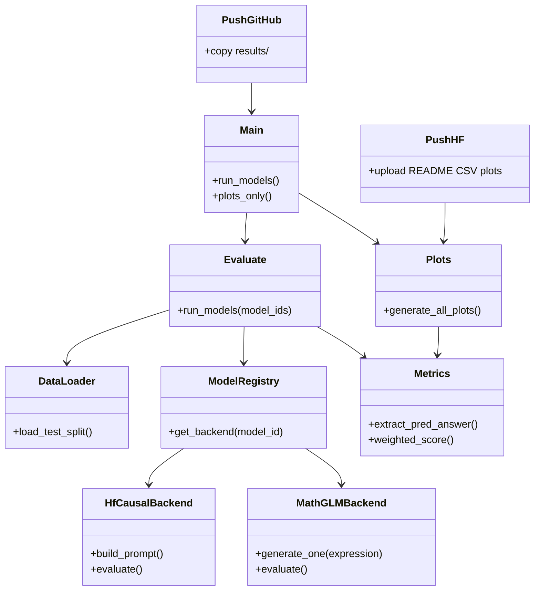
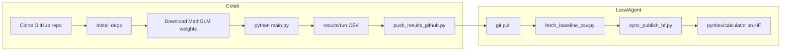

# calculator-benchmark

Evaluation pipeline for the [pymlex/calculator](https://huggingface.co/datasets/pymlex/calculator) arithmetic benchmark. Inference code and Colab workflow live in this repository. Aggregated CSV files, metrics, and the dataset card on Hugging Face are published from run outputs.

## Models

| Registry id | Backend |
|---|---|
| `Qwen/Qwen2.5-Math-1.5B-Instruct` | Transformers chat template, Qwen system prompt |
| `Qwen/Qwen2.5-Math-7B-Instruct` | Transformers chat template, Qwen system prompt |
| `nvidia/AceReason-Nemotron-1.1-7B` | Transformers chat template, [AceReason usage](https://huggingface.co/nvidia/AceReason-Nemotron-1.1-7B) |
| `THUDM/MathGLM-2B` | [MathGLM](https://github.com/THUDM/MathGLM) SAT checkpoint, arithmetic input from `expression` |

Shared generation settings for causal LM models: `max_new_tokens=4096`, greedy decoding (`do_sample=False`). MathGLM uses `max_sequence_length=1024` as in the upstream arithmetic recipe.

## Architecture





## Repository layout

```
calculator-benchmark/
├── calculator_bench/          # Python package
│   ├── config.py
│   ├── data.py
│   ├── metrics.py
│   ├── evaluate.py
│   ├── plots.py
│   └── models/
│       ├── hf_causal.py
│       └── mathglm_sat.py
├── scripts/
│   ├── download_mathglm.sh
│   ├── fetch_baseline_csv.py
│   ├── push_results_github.py
│   ├── push_hf_dataset.py
│   └── sync_publish_hf.py
├── main.py
├── results/
│   ├── run/                   # per-model CSV outputs
│   └── assets/                # plots
└── checkpoints/mathglm-2b/    # weights (not in git)
```

## Colab Pro L4 workflow

### 1. Clone and install

```python
!git clone https://github.com/pymlex/calculator-benchmark.git
%cd calculator-benchmark
!pip install -q -r requirements.txt
!pip install -q -r requirements-mathglm.txt
```

### 2. Secrets

```python
import os
from google.colab import userdata
os.environ["HF_TOKEN"] = userdata.get("HF_TOKEN")
```

Optional: `CALC_BENCH_DATASET`, `MATHGLM_CHECKPOINT_DIR`, `CALC_BENCH_RUN_DIR`.

### 3. MathGLM-2B weights

```python
!bash scripts/download_mathglm.sh
```

Manual mirror if wget fails: [THU cloud MathGLM-2B](https://cloud.tsinghua.edu.cn/d/cf429216289948d889a6/).

Required files under `checkpoints/mathglm-2b/`:

- `model_config.json`
- `latest`
- `1/mp_rank_00_model_states.pt`

### 4. Run new models

Default targets AceReason and MathGLM only:

```python
!python main.py --run-dir results/run
```

All four models:

```python
!python main.py --all-models --run-dir results/run
```

### 5. Push results to GitHub

Configure git in Colab once:

```python
!git config user.email "you@example.com"
!git config user.name "pymlex"
```

```python
!python scripts/push_results_github.py --message "Colab: AceReason and MathGLM results"
```

### 6. Hugging Face dataset card

After results appear on GitHub, on a machine with `HF_TOKEN`:

```bash
python scripts/sync_publish_hf.py
```

This pulls `main`, merges Qwen baseline CSV files from the dataset repo if missing, rebuilds plots for all models present in `results/run/`, and uploads README, CSV, and figures to [pymlex/calculator](https://huggingface.co/datasets/pymlex/calculator).

Plots in the dataset README reference PNG files hosted on GitHub:

`https://raw.githubusercontent.com/pymlex/calculator-benchmark/main/results/assets/...`

## Metrics

Overall accuracy on the test split (3000 examples).

Weighted score with step weights \(s^2\), \(s \in \{1,\ldots,15\}\):

\[
\text{weighted\_score} = \frac{\sum_{s=1}^{15} \mathrm{mean}(\mathrm{correct}_s)\, s^2}{\sum_{s=1}^{15} s^2}
\]

Answer parsing order: `<answer>` tag, `\boxed{}`, last numeric token.

## Qwen baseline numbers

| model_id | overall_acc | weighted_score |
|---|---|---|
| Qwen/Qwen2.5-Math-1.5B-Instruct | 0.758333 | 0.571052 |
| Qwen/Qwen2.5-Math-7B-Instruct | 0.803667 | 0.651044 |

AceReason and MathGLM rows are filled after Colab runs.

## License

GPL-3.0. See [LICENSE](LICENSE).
