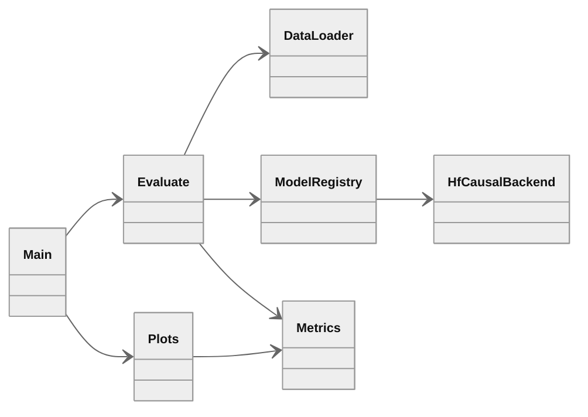

# Calculator benchmark

Evaluation pipeline for the [pymlex/calculator](https://huggingface.co/datasets/pymlex/calculator) arithmetic benchmark. Inference code and Colab workflow live in this repository. Per-model CSV files, metrics, and plots are stored under `results/`. The dataset card on Hugging Face is published from the same outputs via `scripts/sync_publish_hf.py`.

## Models

| Registry id | Backend |
|---|---|
| `Qwen/Qwen2.5-Math-1.5B-Instruct` | Transformers chat template, Qwen system prompt |
| `Qwen/Qwen2.5-Math-7B-Instruct` | Transformers chat template, Qwen system prompt |
| `nvidia/AceReason-Nemotron-1.1-7B` | Transformers, [AceReason usage](https://huggingface.co/nvidia/AceReason-Nemotron-1.1-7B) |
| `nvidia/OpenReasoning-Nemotron-1.5B` | Transformers, [OpenReasoning math prompt](https://huggingface.co/nvidia/OpenReasoning-Nemotron-1.5B) |
| `agentica-org/DeepScaleR-1.5B-Preview` | Transformers, Qwen-style `\boxed{}` prompt |

Shared settings: `max_new_tokens=4096`, greedy decoding (`do_sample=False`).

## Architecture



## Repository layout

```
calculator-benchmark/
├── calculator_bench/
│   ├── config.py
│   ├── data.py
│   ├── metrics.py
│   ├── evaluate.py
│   ├── plots.py
│   └── models/
│       └── hf_causal.py
├── scripts/
│   ├── fetch_baseline_csv.py
│   ├── push_results_github.py
│   ├── push_hf_dataset.py
│   └── sync_publish_hf.py
├── main.py
└── results/
    ├── run/
    └── assets/
```

## Workflow

### 1. Clone and install

```python
!git clone https://github.com/pymlex/calculator-benchmark.git
%cd calculator-benchmark
!git pull
!pip install -q -r requirements.txt
```

### 2. Secrets

```python
import os
from google.colab import userdata
os.environ["HF_TOKEN"] = userdata.get("HF_TOKEN")
```

Optional: `CALC_BENCH_DATASET`, `CALC_BENCH_RUN_DIR`.

### 3. Run evaluation

OpenReasoning-Nemotron-1.5B and DeepScaleR-1.5B-Preview:

```python
!python main.py --models nvidia/OpenReasoning-Nemotron-1.5B agentica-org/DeepScaleR-1.5B-Preview --run-dir results/run
```

Default without `--models` runs the same pair. All registered models:

```python
!python main.py --all-models --run-dir results/run
```

### 4. Push results to GitHub

```python
!git config user.email "you@example.com"
!git config user.name "pymlex"
!python scripts/push_results_github.py --message "Colab: OpenReasoning and DeepScaleR results"
```

### 5. Publish Hugging Face dataset card

On a machine with `HF_TOKEN`:

```bash
python scripts/sync_publish_hf.py
```

This pulls `main`, fetches missing Qwen baseline CSV files from the dataset repo if needed, rebuilds plots for all models in `results/run/`, and uploads README, CSV, and figures to [pymlex/calculator](https://huggingface.co/datasets/pymlex/calculator).

## Benchmark results

Dataset: [pymlex/calculator](https://huggingface.co/datasets/pymlex/calculator) test split, 3000 examples.

Completed runs: Qwen 1.5B, Qwen 7B, AceReason-Nemotron-1.1-7B. After Colab runs for OpenReasoning-Nemotron-1.5B and DeepScaleR-1.5B-Preview, refresh via `scripts/sync_publish_hf.py`.

Weighted score with step weights $s^2$, $s \in \{1,\ldots,15\}$:

$$
\mathrm{weighted\_score} = \frac{\sum_{s=1}^{15} (\mathrm{mean}(\mathrm{correct}_s) \cdot s^2)}{\sum_{s=1}^{15} s^2}
$$

### Models' scores

| model_id | overall_acc | weighted_score |
|---|---|---|
| nvidia/AceReason-Nemotron-1.1-7B | 0.955667 | 0.912847 |
| Qwen/Qwen2.5-Math-7B-Instruct | 0.803667 | 0.651044 |
| Qwen/Qwen2.5-Math-1.5B-Instruct | 0.758333 | 0.571052 |

Answer parsing order: `<answer>` tag, `\boxed{}`, last numeric token.

### Accuracy for different complexities

<p align="center">
  
</p>

### Solution length distribution

<p align="center">
  
</p>

Raw per-model outputs: `results/run/*.csv`. Summary: `results/metrics.json`.

## License

GPL-3.0. See [LICENSE](LICENSE).
